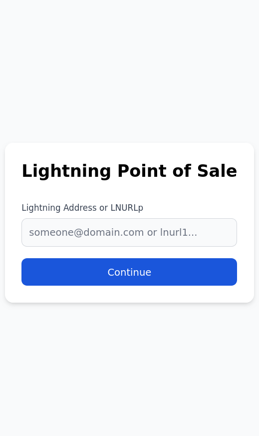

# LNURL PoS

A Lightning Point of Sale (PoS) web app based on [LUD-21](https://github.com/lnurl/luds/blob/master/18.md) (LNURL-pay with verify) for instant, verifiable Lightning payments. This project is designed for merchants and event organizers who want a simple, browser-based interface to accept Lightning payments into their existing Lightning wallet. The money is never held in the PoS app and goes right into the specified LNURL, reducing the risk of having large amounts of Bitcoin on you or having to trust employees with your wallet.

<p align="center">
  
  
  
  
</p>


## Features
- **Lightning Address & LNURLp**: All you need to get the PoS set up is an LNURL or an LN Address that supports [LUD-21](https://github.com/lnurl/luds/blob/luds/21.md).
- **Currency Conversion**: Enter the amount in your local currency, receive sats.
- **Modern UI**: Built with React, Tailwind CSS, and Flowbite.

## Getting Started

### Prerequisites
- [Nix](https://nixos.org/download.html) (for reproducible dev environment)
- [pnpm](https://pnpm.io/) (will be provided by Nix shell, can also be insalled independently)

### Setup with Nix

1. **Enter the Nix development shell:**
   ```bash
   nix develop
   ```
   This will provide you with Node.js and pnpm in a reproducible environment.

2. **Install dependencies:**
   ```bash
   pnpm install
   ```

3. **Run the app in development mode:**
   ```bash
   pnpm dev
   ```
   The app will be available at [http://localhost:5173](http://localhost:5173) by default.

## License

MIT